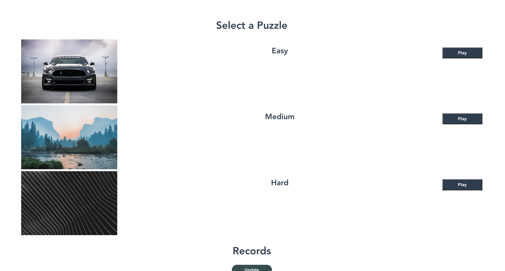
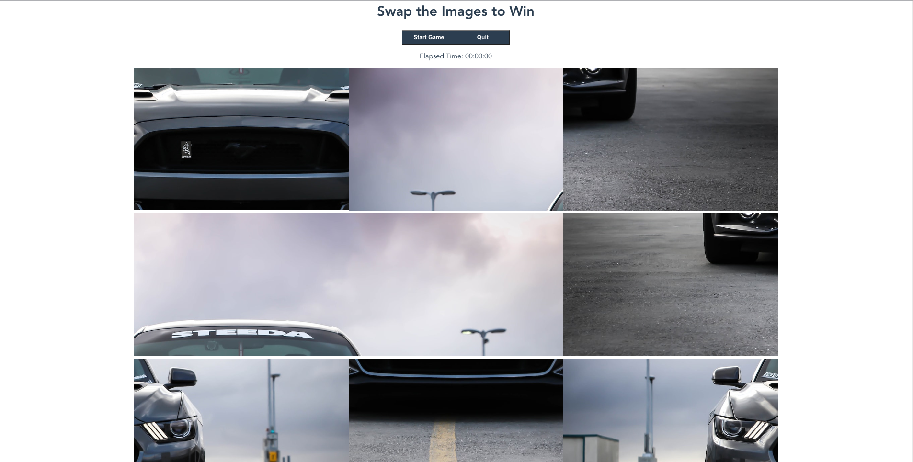
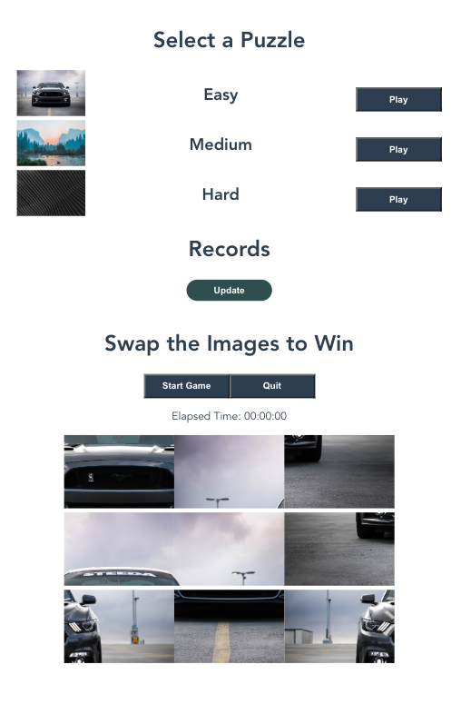
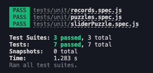

# Vue 3 Slider Puzzle Game

This is a single-page application that allows users to play a slider puzzle game. The game consists of rearranging the parts of a picture until it looks correct. The app has a timer that shows the elapsed time of the game, which is then stored in local storage. Once the puzzle is solved, a message is displayed to the user. 

## Components

The game is created using the following three Vue components:

- Puzzles.vue: This component contains the selection of puzzles with varying difficulties. The component uses computed properties and methods to manage the selection of puzzles and the game's difficulty level.

- Records.vue: This component displays the records of past games, which is stored in local storage.

- SliderPuzzles.vue: This component creates the slider puzzle game itself. It uses computed properties and methods to manage the game's state, including tracking the elapsed time and checking if the puzzle has been solved.

## Technologies Used

The following technologies were used to create this project:

- Vue 3: The app was built using Vue 3.

- HTML5 and CSS3: The app uses HTML5 and CSS3 to provide the layout and styling.

- Unsplash: The images used in the puzzles were sourced from Unsplash.

- Moment: A Vue package called Moment was used to provide the timer functionality.

- Jest: The Javascript test framework Jest was used to perform unit tests on isolated parts of each component.

## Testing
Results carried out from the unit tests mounted on each of the components:

## Getting Started

To run the project, you can follow these steps:

1. Clone the repository from GitHub.

2. Install the required packages using `npm install`.

3. Run the app using `npm run serve`.

4. Access the app in your web browser at `http://localhost:8080`.

## Contributing

If you'd like to contribute to this project, please fork the repository and make changes in your own fork. Once you've made your changes, submit a pull request to the main repository.

## Acknowledgements

We would like to thank the developers of Vue, Jest, Moment, and Unsplash for their contributions to this project.
